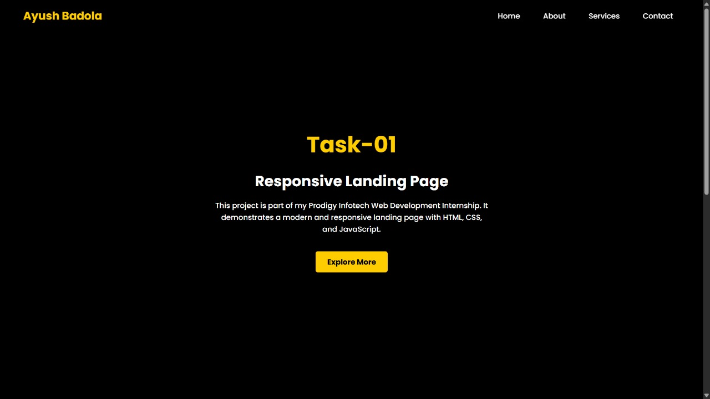

# PRODIGY_WD_01 - Landing Page  

This project is a simple **responsive landing page** built using **HTML, CSS, and JavaScript**.  
It follows a clean dark theme design and demonstrates the use of basic web development skills.  

---

## 🚀 Tech Stack  
- **HTML5** – Structure of the webpage  
- **CSS3** – Styling and responsive design  
- **JavaScript** – Adding interactivity  

---

## 📂 Project Structure  
├── index.html # Main landing page
├── style.css # Styling file
├── script.js # JavaScript interactivity
├── screenshot1.jpg # Preview image 1
├── screenshot2.jpg # Preview image 2
└── README.md # Project documentation

---

## 📸 Preview  

**Landing Page Screenshot 1**  
  

   

**Landing Page Screenshot 2**  
  

---

## ✨ Author  
**Ayush Badola**  
📧 [ayushbadola74@gmail.com](mailto:ayushbadola74@gmail.com)  
🌐 [GitHub Profile](https://github.com/ayushbadola74)  

---
